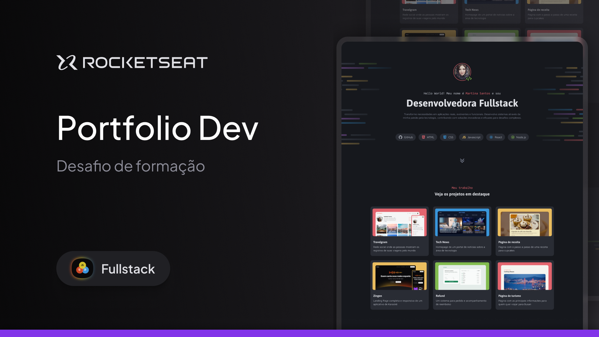

# Desafio prático - Portfólio Dev

Um site desktop de portfólio para desenvolvedores, com links para projetos e contato do profissional.

## Nessa aplicação trabalhamos com:

- Criação de layouts com CSS;
- Posicionamento de elementos;
- Variáveis CSS;
- CSS Flexbox;
- CSS Grid;
- pseudo-class e pseudo-elements;

## 🛠 Tecnologias

Abaixo tecnologias que foram usadas no projeto:

- Html
- Css
- Git e Github

## 👨‍💻 Colaboradores

<table>
    <tr>
         <td align="center"><a href="https://brunogoncalvesferreira.com"> <b>Bruno Gonçalves</b></a> <a href="https://brunogoncalvesferreira.com" title="Bruno Gonçalves Ferreira">👨‍🚀</a></td>
    </tr>
</table>